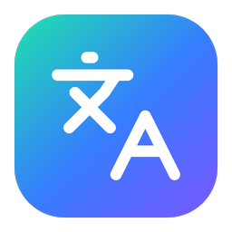
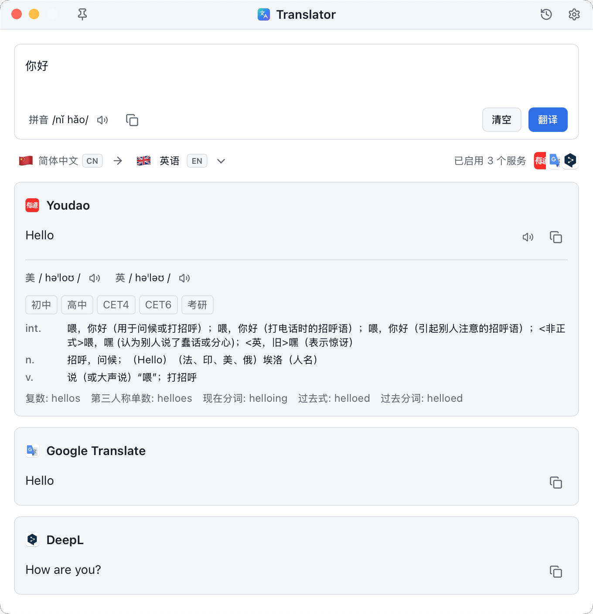
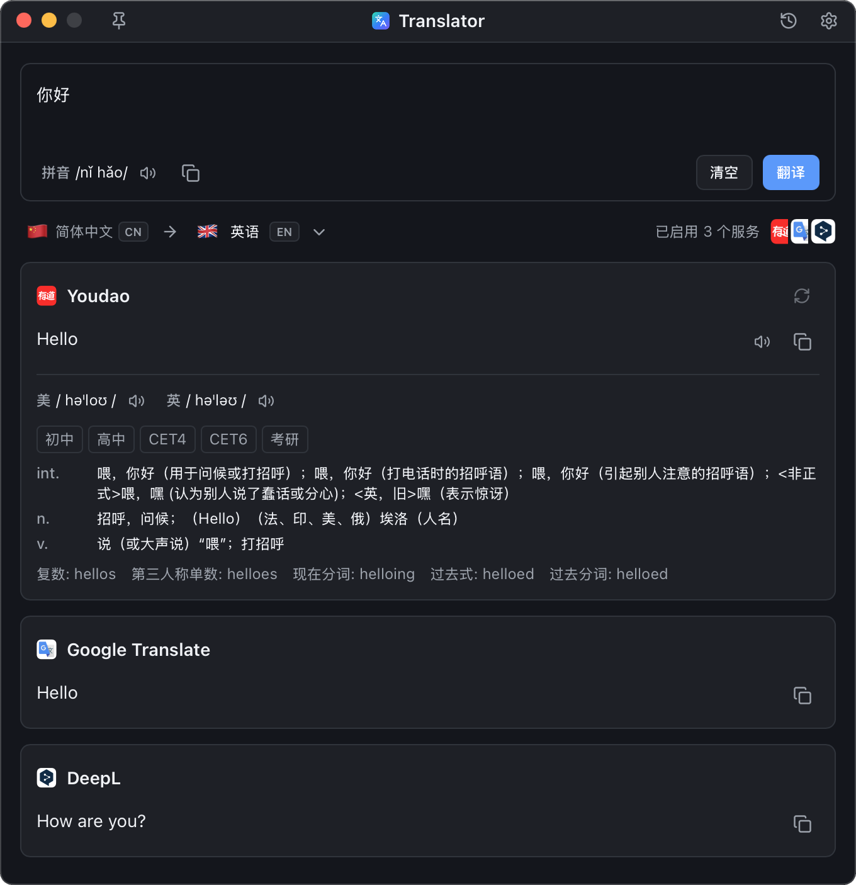

<div align="center">

# Translator



### 크로스 플랫폼 선택-번역 도구

텍스트 선택 → 단축키 입력 → 즉시 번역

[](https://www.gnu.org/licenses/gpl-3.0)
[](https://www.rust-lang.org)
[](https://tauri.app)
[](https://reactjs.org)
[](https://github.com/poneding/translator)
<a href="https://linux.do" alt="LINUX DO"></a>

[English](README.md) | [简体中文](README.zh-Hans.md) | [繁體中文](README.zh-Hant.md) | [日本語](README.ja.md) | [한국어](README.ko.md) | [Français](README.fr.md) | [Deutsch](README.de.md) | [Español](README.es.md) | [Русский](README.ru.md) | [Português](README.pt.md) | [Italiano](README.it.md) | [العربية](README.ar.md)

</div>

---

## ✨ 기능

- 🌍 **전역 단축키** — 모든 앱에서 선택한 텍스트를 즉시 번역
- 🔌 **5개 번역 서비스** — Youdao(有道), DeepL, Google, Bing(Azure), OpenAI 호환
- 🤖 **자동 언어 감지** — 스마트 소스 언어 인식
- 🎯 **메인 창 번역** — 고정, 기록, 오디오 재생, 서비스별 재시도 지원
- 📋 **클립보드 폴백** — 선택을 사용할 수 없을 때 클립보드 번역
- 🔄 **내장 업데이트** — 안정/베타 릴리스 채널
- 🎨 **다크 모드** — 시스템 설정 따름
- 🌏 **12개 UI 언어** — 실시간 앱 언어 전환
- 🔐 **보안 저장** — API 키를 OS 키체인에 저장
- ⚡ **경량** — 약 6MB 바이너리, 메모리 사용량 50MB 미만

## 📸 스크린샷

<div align="center">

<table>
<tr>
<td width="50%">

### 라이트 모드


</td>
<td width="50%">

### 다크 모드


</td>
</tr>
</table>

</div>

## 📥 설치

[GitHub Releases](https://github.com/poneding/translator/releases/latest)에서 플랫폼에 맞는 설치 파일을 다운로드하세요：

| 플랫폼 | 아키텍처 | 권장 다운로드 |
| --- | --- | --- |
| macOS | Intel / Apple Silicon | `.dmg` |
| Windows | x86_64 | `.msi` 또는 `.exe` |
| Linux | x86_64 / arm64 | `.AppImage`、`.deb` 또는 `.rpm` |

다운로드 후 시스템에 맞게 설치하세요：macOS는 `.dmg`를 열고 앱을 응용 프로그램 폴더로 드래그（첫 실행 시 우클릭 → "열기"로 Gatekeeper 우회）, Windows는 설치 프로그램 실행（SmartScreen 경고 시 "추가 정보" → "실행"）, Linux는 `.AppImage`를 직접 실행하거나 패키지 관리자로 `.deb` / `.rpm`을 설치。

소스에서 빌드하려면 아래 [빠른 시작](#-빠른-시작) 섹션을 참조하세요。

## 🚀 빠른 시작

### 전제 조건

- **Rust** 1.81+ (`rustup install stable`)
- **Node.js** 20+
- **플랫폼 종속성:**
  - **macOS**: `xcode-select --install`
  - **Windows**: Microsoft C++ Build Tools + WebView2(Win10+에 사전 설치됨)
  - **Linux**: 
    ```bash
    sudo apt install libwebkit2gtk-4.1-dev build-essential libxdo-dev \
                     libssl-dev libayatana-appindicator3-dev librsvg2-dev
    ```

### 개발

```bash
# JavaScript 종속성 설치
cd ui && npm install && cd ..

# 개발 서버 실행(핫 리로드 활성화)
cargo tauri dev
```

### 릴리스 빌드

```bash
cargo tauri build
```

**출력 위치:** `target/release/bundle/`

- **macOS**: `.dmg` + `.app`
- **Windows**: `.msi` + `.exe`
- **Linux**: `.AppImage` + `.deb`

## 📚 문서

- 📐 [설계 문서](docs/DESIGN.md) — v0.2 아키텍처 개요
- 🏛️ [아키텍처 다이어그램](docs/ARCHITECTURE.svg) — 시각적 컴포넌트 맵
- 🛠️ [개발자 가이드](docs/dev-guide.md) — 코딩 규칙, 테스트, 디버깅
- 👤 [사용자 가이드](docs/user-guide.md) — 설정 지침, API 키, 단축키 사용자 정의

## 📂 프로젝트 구조

```txt
translator/
├── crates/
│   ├── core/         # 순수 Rust 비즈니스 로직 + 5개 번역 서비스
│   ├── platform/     # 크로스 플랫폼 선택 모니터(macOS/Win/Linux)
│   └── app/          # Tauri 셸(명령, 트레이, IPC)
├── ui/               # React + Vite 프론트엔드(메인 창 + 설정)
├── ui/src/locales/   # Fluent 국제화 파일(12개 앱 언어)
├── docs/             # 설계 + 사용자/개발자 가이드
└── .github/          # CI + 릴리스 워크플로우
```

## 🤝 기여

기여를 환영합니다! PR을 제출하기 전에 [개발자 가이드](docs/dev-guide.md)를 읽어주세요.

## 📄 라이선스

GPL-3.0-only. 자세한 내용은 [LICENSE](LICENSE)를 참조하세요.

## ⭐ 스타 히스토리

[](https://star-history.com/#poneding/translator&Date)

---

<div align="center">

**Rust + Tauri 2 + React로 구축, ❤️를 담아**

</div>
